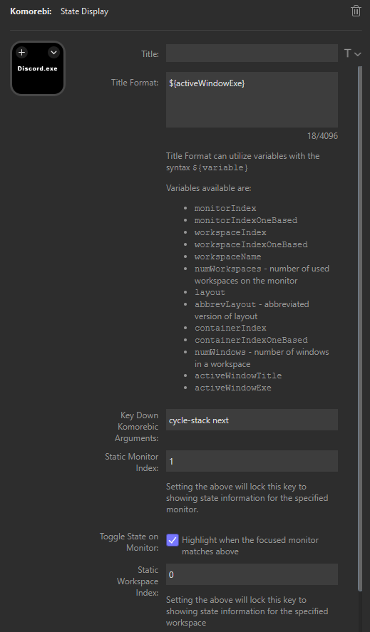

# streamdeck-komorebi
Displays [Komorebi](https://github.com/LGUG2Z/komorebi) state information and optionally responds to key down events on the Elgato Stream Deck

## Table of Contents

- [Features](#features)
- [Installation](#installation)
- [Usage](#usage)
- [Contributing](#contributing)
- [License](#license)
- [Contact](#contact)

## Features

- **Templatized State Info**: Show and customize Komorebi state information on the key (active monitor index, active workspace index, active layout, window title..etc)
- **Monitor/Workspace Assocation**: Associate a Stream Deck key to a specific monitor and/or workspace. Optionally highlight when monitor/workspace has focus
- **Focus Monitor/Workspace**: Optionally focus on the specified monitor/workspace on key-down
- **Execute Komorebic**: Provide command for komorebic on key-down such as `cycle-stack`, `toggle-float`...etc
- **Long press**: Provide alternative long press functionality

## Roadmap
- **Image customization**: Provide better image customization
- **Komorebi monitoring**: Provide better monitoring if komorebi goes down. Maybe when [wpm](https://github.com/LGUG2Z/wpm) is ready
- **More window specific context**: For example, toggle icon based on tiling mode

## Installation

Download the [latest release](https://github.com/kdeenanauth/streamdeck-komorebi/releases) and double-click to install.

## Usage

Plugin can be configured once added to a key:


## Contributing

Contributions are welcome! Please follow these steps:

1. Fork the repository.
2. Create a new branch:
   ```bash
   git checkout -b feature/YourFeatureName
   ```
3. Make your changes and commit:
   ```bash
   git commit -m 'Add some feature'
   ```
4. Push to the branch:
   ```bash
   git push origin feature/YourFeatureName
   ```
5. Create a pull request.

## License

This project is licensed under the MIT License - see the [LICENSE](LICENSE) file for details.

## Contact

If you have any questions, feel free to reach out:

- **Email**: kevin@deenanauth.com
- **Bluesky**: [@kdeenanauth.bsky.social](https://bsky.app/profile/kdeenanauth.bsky.social)
